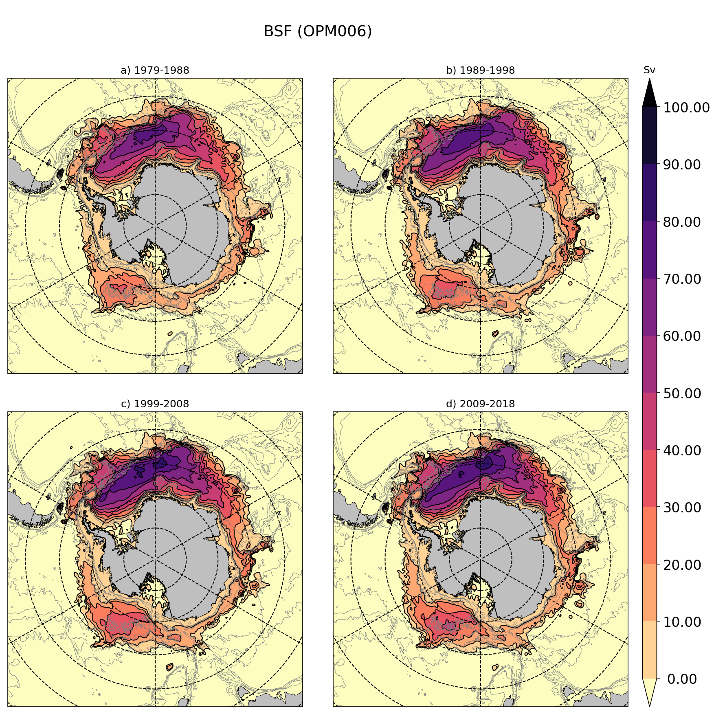

# PyChart
PyChart is a tool to map from netcdf output

## Example output
Below you can find an exemple of the kind of output from PyChart:



The command line to produce this plot is:

```
python ~/GIT/PyChart/pychart.py \
   --ft 'BSF (OPM006)' \
   --spfid '1979-1988'                            '1989-1998'                           '1999-2008'                            '2009-2018'                         \
   --mapf eORCA025.L121-OPM006_10y_y1979_psi.nc eORCA025.L121-OPM006_10y_y1989_psi.nc eORCA025.L121-OPM006_10y_y1999_psi.nc eORCA025.L121-OPM006_10y_y2009_psi.nc  \
   --cntf eORCA025.L121-OPM006_10y_y1979_psi.nc eORCA025.L121-OPM006_10y_y1989_psi.nc eORCA025.L121-OPM006_10y_y1999_psi.nc eORCA025.L121-OPM006_10y_y2009_psi.nc  \
   --mapv sobarstf \
   --cntv sobarstf \
   --cblvl  0 100 10 \
   --cntlvl 0 100 10 \
   --cbu Sv \
   --cbn magma_r \
   --mapsf 0.000001 \
   --cntsf 0.000001 \
   --cbext both \
   --mesh   mesh.nc     \
   --bathyf mesh.nc     \
   --bathyv bathy_metry \
   --bathylvl 1000 2000 3000 4000 \
   -p south_ocean \
   --sp 2x2 \
   -o bsf_OPM006
```

## Requirement

PyChart is tested with this conda environement (environment.yml):
```
name: PyChart
channels:
  - defaults
dependencies:
  - python=3.7.4
  - cartopy
  - gsw
  - scipy
  - netcdf4
  - dask
  - xarray
  - jupyter
  - seawater
```

This environement can be created via this command:
```
conda env create -f environment.yml
```
with environment.yml being the environement file described above.

## Usage

### Map options:

```
[--mapf]    : list of file to plot (X files => X subplots)
[--mapv]    : list of variable to plot. 
              1 variable only (same variable is assume for all the plots 
              or 1 variable per --mapf files
[--mapreff] : reference file for comparison purposes. 
              [--mapf] file - [--mapreff] file will be plot.
[--mapreff] : variable to use in the --mapreff file
[--mapsf]   : scale factor to use if different to 1.
              useful for transport for example, see example.
[--mapjk]   : jk level to plot (level 1)
[--mapz]    : instead of --mapjk, user can specify --mapz in m.
              In this case, the closest level to --mapz will be ploted. 
```

### Contour options:

Same options as for the map but with 'cnt' prefixe instead of 'map' are available.

### Color map options:

```
[--cbn]  : name of the python cmap to use (default 'jet')
[--cbu]  : unit of colormap (will be plotted on top of the colorbar, see example)
[--cblvl]: define the range of value to plot and the number of color to plot.
           [cmin cmax cint] (if cint is missing default is 10)
           or list of values for irregular colorbar.
[--cbfmt]: format of the colorbar text label
[--cbext]: define if you want to extend the colorbar ['min', 'max', 'both'].
```

### Mesh mask and Bathymetry options:

```
[--mesh]    : mesh or coordinate file to use (1 file or 1 per --mapf)
[--mask]    : mask file to use (1 file or 1 per --mapf)
[--bathy]   : bathymetry files to use (1 file or 1 per --mapf)
[--bathyv]  : bathymetry variable to plot (1 variable or 1 variable per --bathyf)
[--bathylvl]: isodepth line to plot
```

### Miscelenous options:

```
[-ft]    : Figure title (see example)
[--spfid]: subplot title (see example)
[--sprid]: name of the reference (subplot title will be in this case [--spfid] - [--sprid])
[--sp]   : subplot disposition (X x Y). 
           The number of subplot need to be larger than the number of [--mapf] files.
[-p]     : projection name
```

### Python usage:

```
usage: plot_maps.py [-h] [--dir data_dir] --mapf pcolor_file_names
                    [pcolor_file_names ...] --mapv pcolor_var_names
                    [pcolor_var_names ...] [--mapreff pcolor_ref_file_name]
                    [--maprefv pcolor_ref_var_name]
                    [--mapsf pcolor_scale_factor] [--mapjk pcolor_jk_depth]
                    [--mapz pcolor_z_depth] [--cbn colormap_name] --cblvl
                    colorbar_range [colorbar_range ...] [--cbu colorbar_unit]
                    [--cbfmt colorbar_fmt] [--cbext colorbar_extend]
                    [--ft figure_title] [--spfid runid [runid ...]]
                    [--sprid refid]
                    [--mask mask file name [mask file name ...]]
                    [--mesh mesh file name [mesh file name ...]]
                    [--sp subplot disposition] [-o output name]
                    [-p projection] [--cntf contour file [contour file ...]]
                    [--cntv contour var] [--cntreff contour ref file]
                    [--cntrefv contour ref var]
                    [--cntsf contour data scale factor]
                    [--cntjk contour jk level] [--cntz contour depth in m]
                    [--cntlvl contour line level [contour line level ...]]
                    [--bathyf bathy file [bathy file ...]]
                    [--bathyv bathy var]
                    [--bathylvl contour line level [contour line level ...]]
                    [--secf section line file list  [section line file list  ...]]

optional arguments:
  -h, --help            show this help message and exit
  --dir data_dir        data dir
  --mapf pcolor_file_names [pcolor_file_names ...]
                        names of input files
  --mapv pcolor_var_names [pcolor_var_names ...]
                        variable list
  --mapreff pcolor_ref_file_name
                        names of ref files
  --maprefv pcolor_ref_var_name
                        reference variable name
  --mapsf pcolor_scale_factor
                        map data scale factor
  --mapjk pcolor_jk_depth
                        level in fortran convention
  --mapz pcolor_z_depth
                        depth of the map
  --cbn colormap_name   color map name
  --cblvl colorbar_range [colorbar_range ...]
                        color range
  --cbu colorbar_unit   colorbar unit
  --cbfmt colorbar_fmt  colorbar format
  --cbext colorbar_extend
                        colorbar extend
  --ft figure_title     title of the whole figure
  --spfid runid [runid ...]
                        runids (title + mesh name)
  --sprid refid         refids (title + mesh name)
  --mask mask file name [mask file name ...]
                        mask file name
  --mesh mesh file name [mesh file name ...]
                        mesh file name
  --sp subplot disposition
                        subplot disposition (ixj)
  -o output name        output name
  -p projection         projection
  --cntf contour file [contour file ...]
                        contour file list
  --cntv contour var    contour variable
  --cntreff contour ref file
                        contour reference file
  --cntrefv contour ref var 
                        contour reference variable
  --cntsf contour data scale factor
                        contour data scale factor
  --cntjk contour jk level
                        contour jk level
  --cntz contour depth in m
                        contour depth in m
  --cntlvl contour line level [contour line level ...]
                        contour line level
  --bathyf bathy file [bathy file ...]
                        bathy file
  --bathyv bathy var    contour variable
  --bathylvl contour line level [contour line level ...]
                        contour line level
  --secf section line file list  [section line file list  ...]
                        section file list describing section to plot
```
